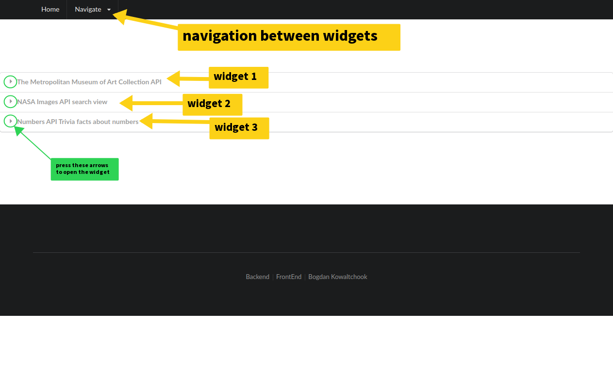
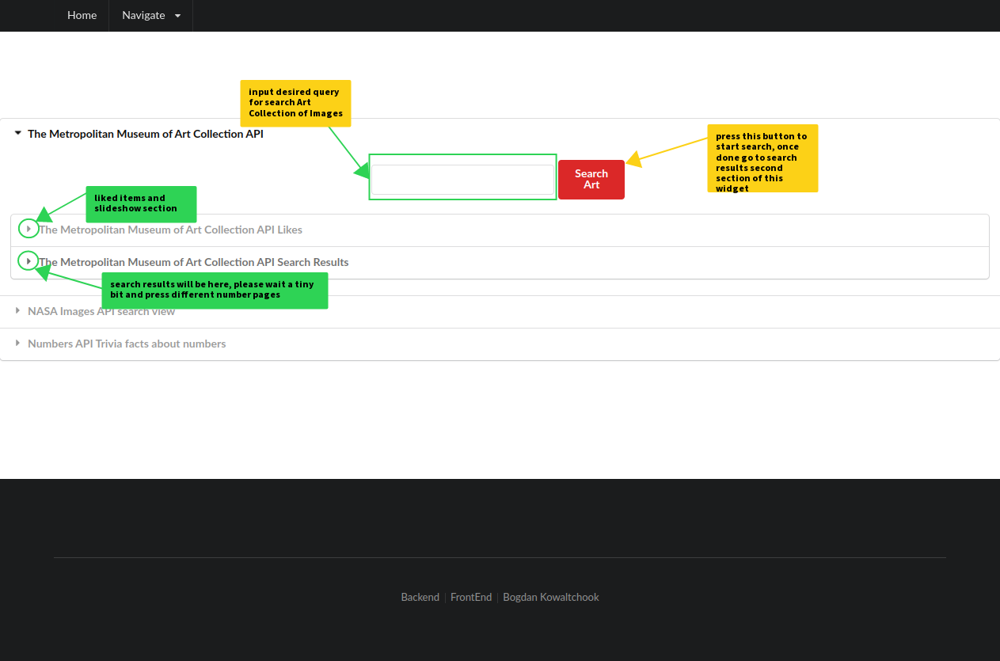
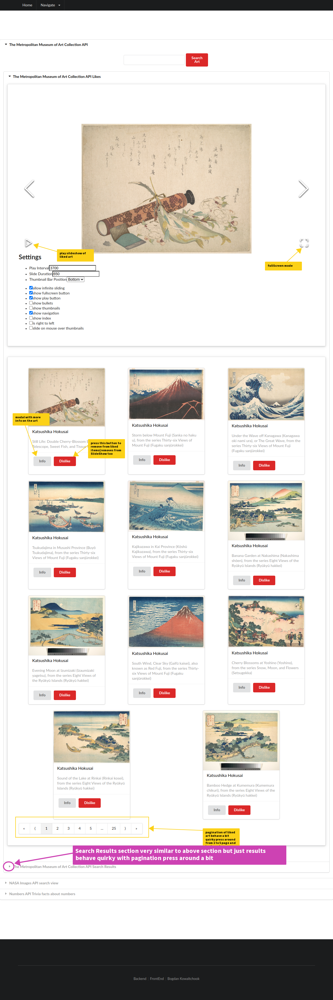
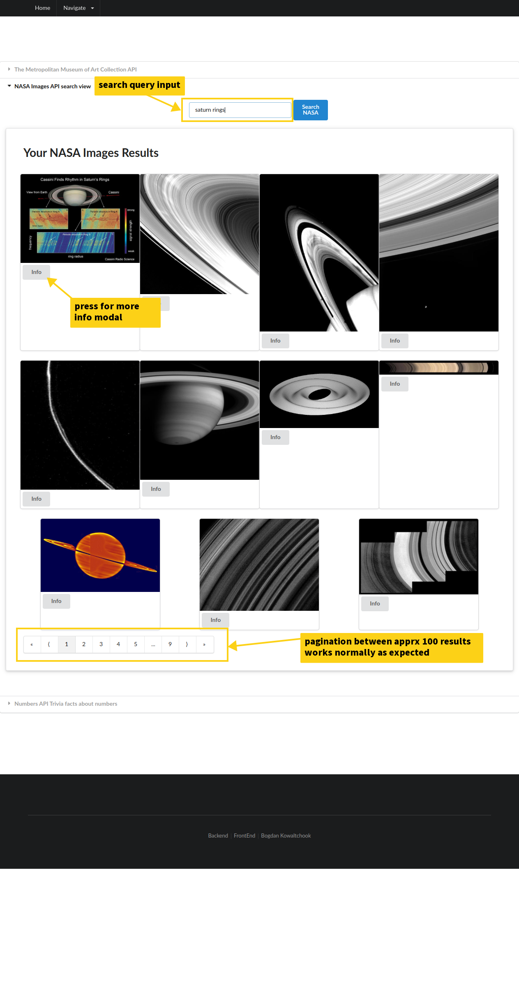
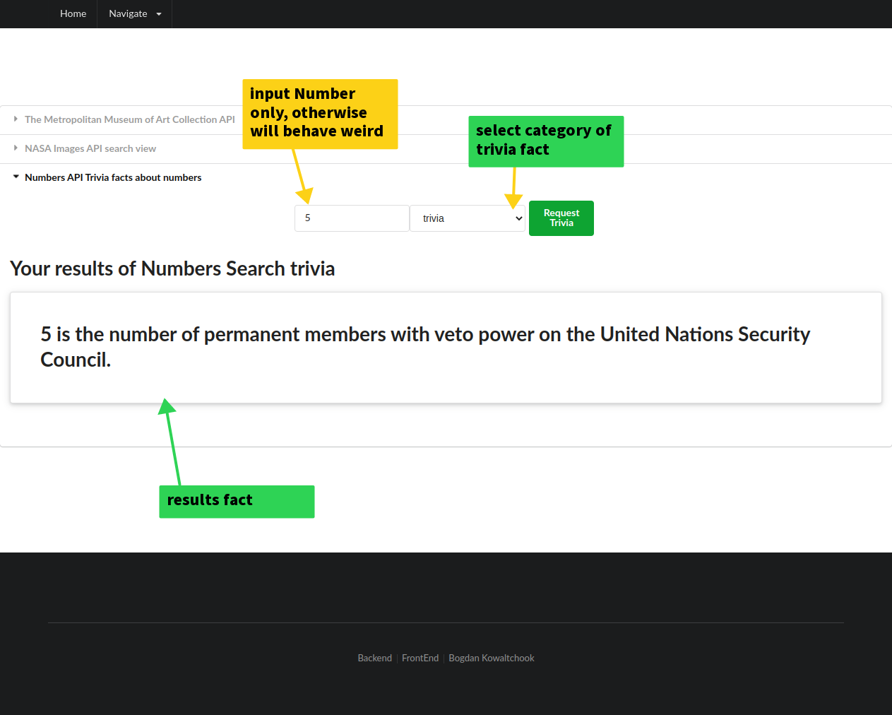

# Term 2 capstone project

This project consists of three widgets and referencing another backend github repository that is needed to fully utilize first widget. You can find the backend by link here [backend github repo term 2 capstone by Bogdan Kowaltchook](https://github.com/EdmontDantes/term2-capstone-backend)

## Technologies used  
- React javascript frontend library https://reactjs.org/
- Node.js javascript runtime environment https://nodejs.org/en/
- React Carousel Image Gallery https://www.npmjs.com/package/react-image-gallery
- Semantic UI React the official React integration for Semantic UI https://react.semantic-ui.com/
- Express web application framework https://expressjs.com/
- MongoDB cross-platform document-oriented database program https://www.mongodb.com/
- Mongoose an Object Data Modeling (ODM) library for MongoDB and Node.js https://mongoosejs.com/
- CORS npm middleware to connect backend and frontend https://www.npmjs.com/package/cors


### Widget 1
This is The Metropolitan Museum of Art Collection API search of public domain art that is available to the public. It is composed of two components the search results and liked items that you can view as a desktop full-screen slideshow.

### Widget 2
This is public no API key NASA images search that will yield approximately 100 results where you can view their information such as description and location taken of the image as well of the photographer if such information is available.

### Widget 3
This is public Numbers API trivia where you can input a number and choose category to display trivia facts about inputted number.

## Visual Guide
#### homepage

#### Navigating Widget 1

#### Widget 1 liked navigation

#### Widget 2 NASA images

#### Widget 3 Numbers Trivia

    

## Additional information      


Please make sure that you are using .env file in backend. Port has to be 8505 as it is hardcoded in the frontend unless you want to change it then refer to App.js in component directory file to change the links to backend routes.
```
PORT = 8505
MONGODB_URI = 'mongodb://localhost/term2-capstone'
```
